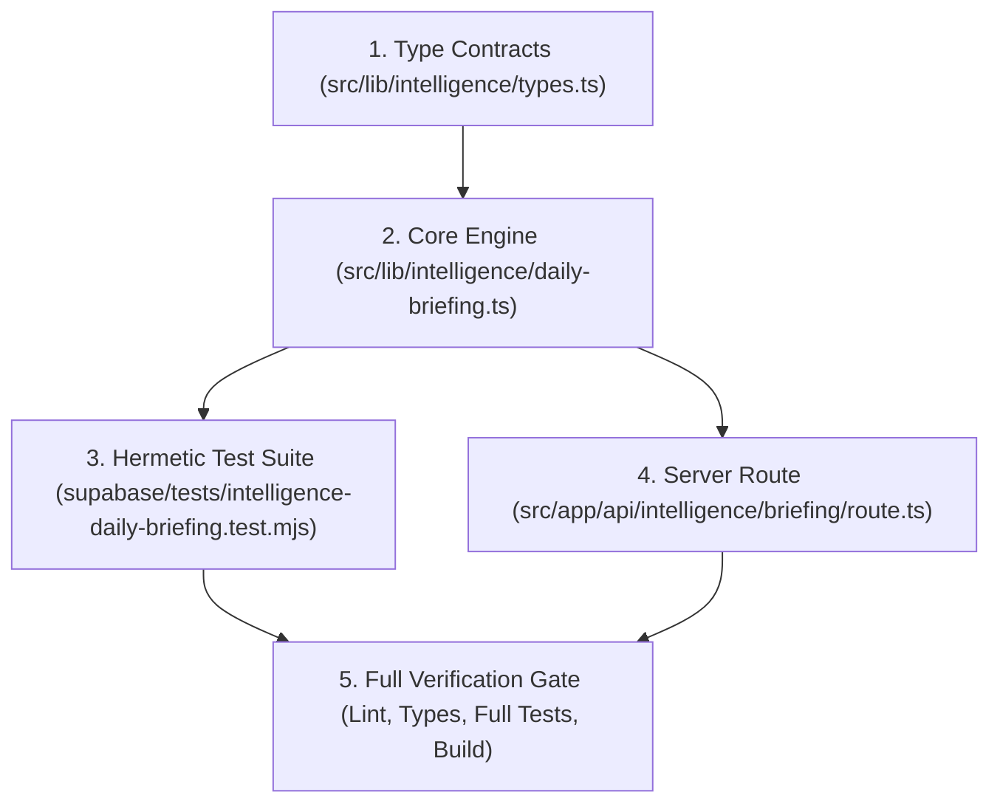

# Implementation Plan: Autonomous Missions (`autonomous-missions`)

Initiative: **Intelligence Engine 2.0**  
Module: **`autonomous-missions`**  
Status: **Ready for Execution**  
Date: 2026-10-02  

---

## 1. Architecture & Component Dependency Graph

---

## 2. Implementation Order

1. **Phase 1: Types & Interfaces**
   - Add `BriefingFocusItem`, `DailyBriefingMetrics`, `DailyBriefing`, and `GenerateBriefingOptions` to `src/lib/intelligence/types.ts`.
   - Ensure clean exports without breaking existing intelligence types.

2. **Phase 2: Core Briefing Engine (`src/lib/intelligence/daily-briefing.ts`)**
   - Build `computeBriefingMetrics(context, todayCivil)`:
     - Count tasks due today, overdue tasks, completed tasks, and urgent signals.
   - Build `selectTopFocusItems(context, todayCivil)`:
     - Deterministic priority scoring: overdue critical tasks > due today high-priority > unblocked goals > key signals.
     - Clamped to top 3 items with explanatory `reason`.
   - Build `generateAttentionAlerts(context, todayCivil)`:
     - Generate structured alerts for blocker situations, overdue counts, or zero-activity warnings.
   - Build `generateDailyBriefing(options)`:
     - Assemble headline, date context, schedule summary (from calendar events if present).
     - Provide localized fallback greeting (FR/EN via `i18n.ts`).
     - Optional LLM polish via `ai-provider.ts` (with strict fallback to deterministic template).
   - In-memory briefing memoization per `(workspaceId, civilDate)`.

3. **Phase 3: Hermetic Test Suite (`supabase/tests/intelligence-daily-briefing.test.mjs`)**
   - Verify deterministic output against simulated snapshots:
     - Empty workspace (no crashes, clean friendly zero-state).
     - Workspaces with overdue, today-due, and completed tasks.
     - Priority ranking assertions (overdue beats future tasks).
     - Bounded array lengths (max 3 focus items, max 5 alerts).
     - Multi-tenant isolation (Workspace A data != Workspace B data).
     - Date & timezone boundary behavior.

4. **Phase 4: API Endpoint (`src/app/api/intelligence/briefing/route.ts`)**
   - Implement `GET /api/intelligence/briefing`:
     - Authenticate session via Supabase `auth.getUser()`.
     - Extract `workspace_id` from query/header and verify user's active membership.
     - Build current workspace context snapshot via `buildWorkspaceContext`.
     - Return 200 with typed `DailyBriefing` payload.
   - Implement optional `POST /api/intelligence/briefing` (to force refresh / bypass cache):
     - Origin & CSRF verification (`assertAllowedOrigin`).

5. **Phase 5: Quality Gate & Validation**
   - Add test runner script to `package.json` if necessary, or integrate into `test:intelligence`.
   - Run `npm run lint` (0 errors, 0 warnings).
   - Run `npm run type-check` (0 errors).
   - Run `npm test` (all suites pass).
   - Run `npm run build` (Next.js production build succeeds cleanly).

---

## 3. Risks & Mitigations

| Risk | Mitigation |
|---|---|
| **LLM Latency / Downtime** | Generation is 100% deterministic first; LLM enrichment is optional, non-blocking, and timeouts after 2500ms. |
| **Empty or Incomplete Data** | All metric calculators handle empty arrays and missing fields safely with fallback defaults. |
| **Cross-Workspace Data Leak** | Context builder is explicitly passed `workspaceId`; API route asserts membership before generating context. |
| **Timezone Skew** | Accepts user's civil date string (YYYY-MM-DD) or resolves via workspace timezone setting. |
